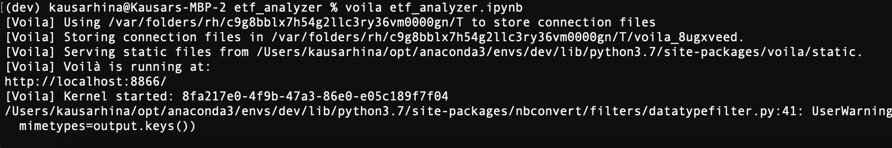

## etf_analyzer

The **etf_analyzer** builds a financial database and web application by using SQL, Python, and the Voila library to analyze the performance of a hypothetical fintech ETF.

## Technologies

This project leverages python 3.7.13 with the following packages:

* [pandas](https://pandas.pydata.org/) - For data analysis
* [Voila](https://voila.readthedocs.io/en/stable/) - For building interactive web applications directly from our Jupyter notebook.


---

## Installation Guide

Before running the application first install the pandas dependency in conda dev environment.

```python

    conda create -n dev python=3.7 anaconda

    python -m ipykernel install --user --name dev

    conda activate dev

    conda install pandas

    conda deactivate 
  
```

---


## Usage

To use the **etf_analyzer** simply clone the repository and run the **etf_analyzer.ipynb** with Voila:

```python
    conda activate dev

    voila etf_analyzer.ipynb

    conda deactivate 
```

The screenshot of, how to run etf_analyzer.ipynb with Voila as web app




The screenshot of, how to access web app from browser using http://localhost:8866/


---

## Contributors

Kausar Hina

---

## License

MIT
